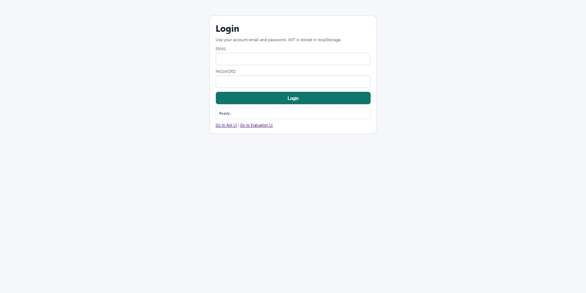
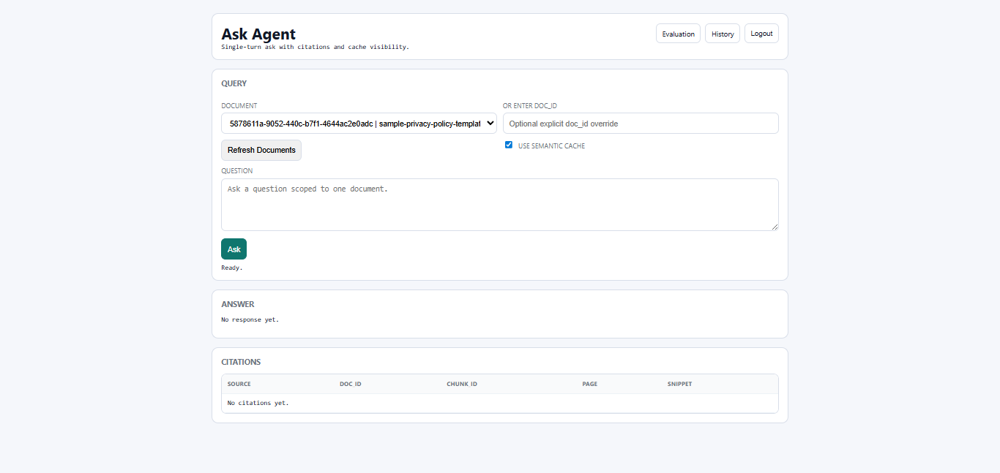
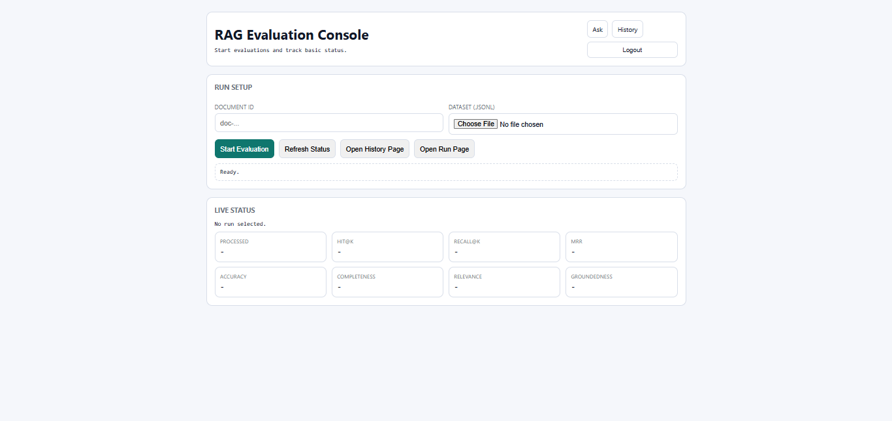
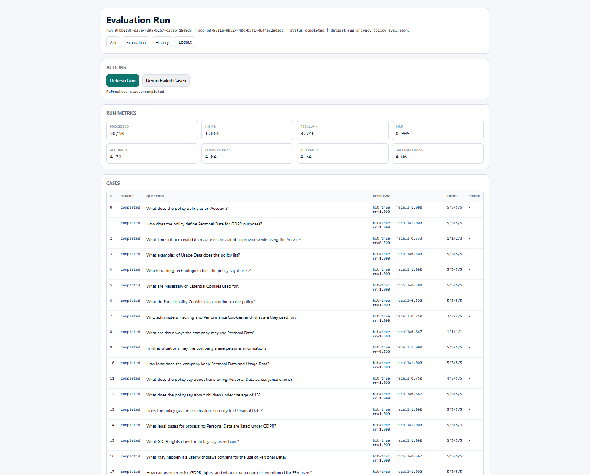
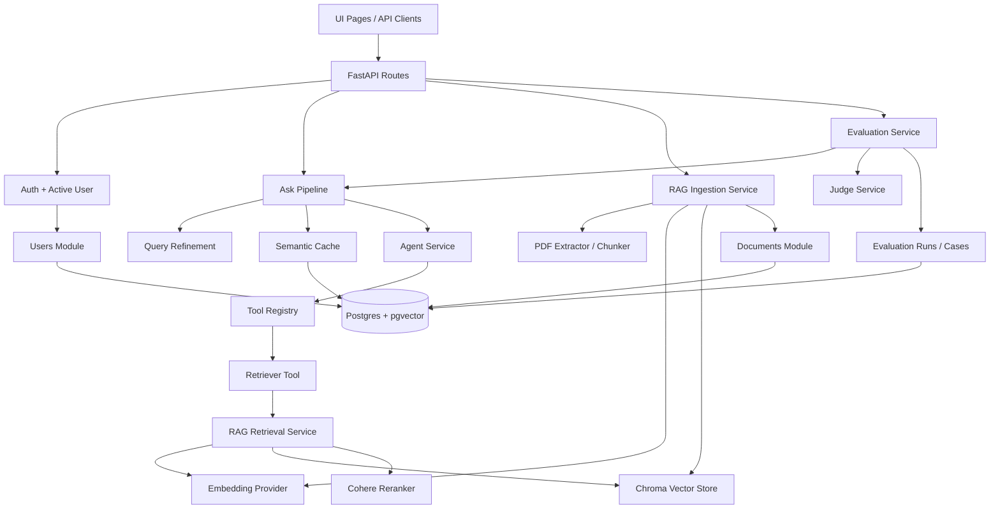

# Agentic RAG

Production-oriented FastAPI starter for authenticated, document-scoped, evaluation-driven RAG systems.

This project is built around a simple idea: a RAG app should not stop at ingestion and retrieval. It should support ownership, scoped access, caching, evaluation, and a usable UI from day one.

## Why This Repo Exists

Most RAG demos stop at "upload text, ask question". This project goes further:

- authenticated users and owned documents
- document-scoped retrieval to prevent cross-document leakage
- text and PDF ingestion
- pluggable embeddings and reranking
- semantic answer cache
- evaluation pipeline with run history, case inspection, and rerun support
- simple built-in UI for asking questions and running evaluations

## Demo Surface

Main UI pages:

- `/login-ui` - login page with JWT-based browser auth
- `/ask-ui` - single-turn ask UI with citations, cache status, and refined query
- `/evaluation-ui` - create evaluation runs
- `/evaluation-history-ui` - compare historical runs
- `/evaluation-runs/{run_id}/ui` - inspect cases and rerun failed ones

Demo video:

- [Watch the demo video](https://player.puppydog.io/play/0od5an)

### Login UI

<p align="center">
  
  
</p>

### Evaluation UI

<p align="center">
  
  
</p>

## Features

- Agent loop with tool calling
- Retriever tool integrated into the agent workflow
- Chroma vector store with persistent local storage
- OpenAI and Hugging Face embedding providers
- Optional Cohere reranker
- Query refinement before retrieval and semantic cache lookup
- Semantic cache backed by Postgres + pgvector
- Text ingestion and text-based PDF ingestion with page metadata
- Page-aware citations in answers
- User authentication with access + refresh JWT flow
- Document ownership, listing, and soft delete
- Evaluation pipeline with retrieval metrics and LLM-judge answer metrics
- Jinja-based UI for asking questions and managing evaluation runs
- Dockerized local development stack with Postgres + pgAdmin

## Architecture

At a high level, the system is split into API routes, agent orchestration, RAG services, infrastructure adapters, and domain modules for users, documents, evaluation, and semantic cache.



## Tech Stack

- API: FastAPI
- ORM / DB: SQLAlchemy, Alembic, PostgreSQL, pgvector
- Vector DB: Chroma
- LLM: OpenAI-compatible chat backend
- Embeddings: OpenAI or Hugging Face
- Reranking: Cohere
- Auth: FastAPI Users + custom JWT login/refresh flow
- PDF extraction: `pdfplumber`, `pandas`, `rapidfuzz`
- UI: Jinja templates + shared browser auth client
- Dev/runtime: Docker, Docker Compose, `uv`

## Project Layout

```text
src/
  agents/                ask pipeline, agent loop, cache policy, query refinement
  api/v1/                routes, schemas, dependency wiring
  infrastructure/        llm, vector db, reranker, database adapters
  modules/
    users/               auth model and user dependencies
    documents/           ownership and document lifecycle
    semantic_cache/      pgvector-backed answer cache
    evaluation/          eval runs, cases, judge service
  rag/
    ingestion/           chunker and PDF extractor
    pipeline/            ingestion and retrieval services
    embeddings/          provider contracts
    reranker/            reranker contracts
    vectorstore/         vector store contracts
  settings/              app configuration
  tools/                 retriever tool and registry
templates/               Jinja UI pages
static/                  shared browser JS
tests/                   unit and integration tests
alembic/                 database migrations
data/                    local Chroma persistence
```

## API Overview

Core endpoints:

- `POST /auth/jwt/login`
- `POST /auth/jwt/refresh`
- `POST /auth/jwt/logout`
- `GET /users/me`
- `POST /rag/ingest/text`
- `POST /rag/ingest/pdf`
- `POST /agent/ask`
- `GET /documents`
- `GET /documents/{doc_id}`
- `DELETE /documents/{doc_id}`
- `POST /evaluations/rag`
- `GET /evaluations`
- `GET /evaluations/{run_id}`
- `GET /evaluations/{run_id}/cases`
- `GET /evaluations/{run_id}/report`
- `POST /evaluations/{run_id}/rerun-failed`
- `GET /llm/health`
- `GET /tools/health`

## Getting Started

### Prerequisites

- Python `3.12+`
- `uv`
- Docker and Docker Compose
- API credentials for the providers you enable

### Environment

Start from the example file:

```bash
cp .env.example .env
```

At minimum, review:

- database settings
- JWT secrets
- model and provider settings
- reranker settings if enabled
- evaluation judge model

## Run With Docker

This is the fastest way to boot the full stack locally.

```bash
docker compose up --build
```

Services:

- API: `http://localhost:8000`
- Swagger UI: `http://localhost:8000/docs`
- pgAdmin: `http://localhost:5050`

The app container runs Alembic migrations on startup and serves FastAPI with reload enabled for local development.

## Run Locally Without Docker

Install dependencies:

```bash
uv sync --dev
```

Run migrations:

```bash
uv run alembic upgrade head
```

Start the app:

```bash
uv run uvicorn main:app --reload
```

## Typical Workflow

### 1. Register and log in

- Register through Swagger or your auth flow
- Log in from `/login-ui` or `POST /auth/jwt/login`

### 2. Ingest a document

Text:

```bash
curl -X POST http://localhost:8000/rag/ingest/text \
  -H "Authorization: Bearer <token>" \
  -H "Content-Type: application/json" \
  -d "{\"text\":\"...\",\"source\":\"inline-text\"}"
```

PDF:

Use `POST /rag/ingest/pdf` with multipart upload and the same bearer token.

### 3. Ask the agent

```bash
curl -X POST "http://localhost:8000/agent/ask?use_cache=true" \
  -H "Authorization: Bearer <token>" \
  -H "Content-Type: application/json" \
  -d "{\"doc_id\":\"<doc_id>\",\"question\":\"What does the policy define as an Account?\"}"
```

The response includes:

- final answer
- `cache_status`
- `refined_query`
- `tools_used`
- `steps`
- citations with `doc_id`, `chunk_id`, and optional `page_number`

### 4. Run evaluation

- Open `/evaluation-ui`
- upload a JSONL dataset
- select a `doc_id`
- start a run and monitor progress
- inspect `/evaluation-history-ui` for comparisons

## Evaluation

The evaluation system tracks both retrieval quality and answer quality.

Retrieval metrics:

- Hit@k
- Recall@k
- MRR

Answer metrics:

- Accuracy
- Completeness
- Relevance
- Groundedness

Each evaluation run stores:

- aggregate metrics
- per-case results
- generated answers
- citations
- retrieval rankings
- configuration snapshot for reproducibility

## Configuration

Settings are composed from:

- [ai.py](d:/Agnetic%20AI/my-projects/agentic-rag/src/settings/ai.py)
- [agent.py](d:/Agnetic%20AI/my-projects/agentic-rag/src/settings/agent.py)
- [rag.py](d:/Agnetic%20AI/my-projects/agentic-rag/src/settings/rag.py)
- [database.py](d:/Agnetic%20AI/my-projects/agentic-rag/src/settings/database.py)
- [auth.py](d:/Agnetic%20AI/my-projects/agentic-rag/src/settings/auth.py)
- [evaluation.py](d:/Agnetic%20AI/my-projects/agentic-rag/src/settings/evaluation.py)
- [config.py](d:/Agnetic%20AI/my-projects/agentic-rag/src/settings/config.py)

Main configurable areas:

- model and provider selection
- chunk size and overlap
- top-k and prefetch-k
- reranker enablement and model
- semantic cache threshold
- query refinement enablement
- PDF limits
- auth cookie behavior
- evaluation judge model and limits

## Extending The System

Common extension points:

- add new tools under `src/tools/`
- add a new embedding provider behind the embedding interface
- swap the vector store implementation behind the vector store contract
- add new ingestion sources such as HTML, DOCX, or external connectors
- add new evaluation datasets and domain-specific judge prompts
- harden multi-tenant isolation further if you move beyond single-doc ask scope

## Testing

Run the test suite locally:

```bash
uv run pytest
```

If you run tests in Docker, make sure the `tests/` directory is mounted into the app container.

## Contributing

Issues, bug reports, architecture suggestions, and focused PRs are welcome. Keep changes small, explicit, and test-backed where possible.

## License

[MIT](LICENSE)

## Support

If this repo helps you, open an issue, share feedback, or star the project.
